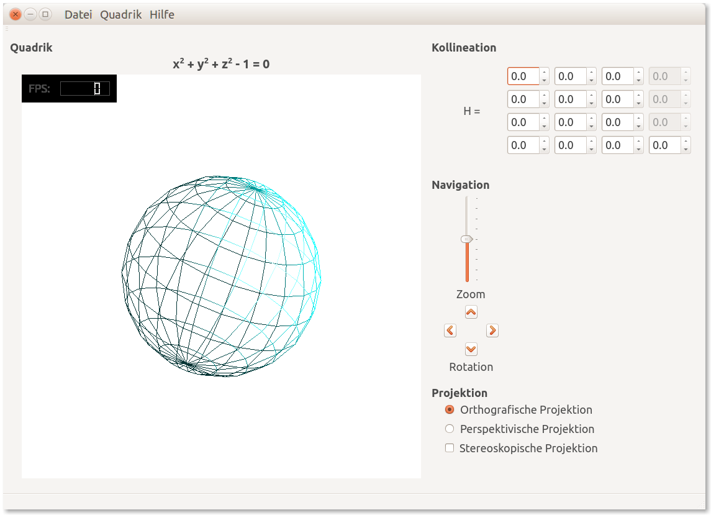

# Quadriken im Raum

Desktop-Applikation zur Visualisierung von Quadriken im Raum.

 *Fig. 1.: GUI der Desktop-Applikation QIR*

## Lösung

- Stichworte: Geometrische Algebra, Projektiver Raum, homogene Koordinaten, Kollineation, projektive und geometrische Transformation, orthogonale und perspektivische Projektion, Stereoskopie, spektrales Multiplexing, Farbanaglyphen. 
- Technologie: Qt-Designer, QGLWidget, C/C++, OpenGL, GLU, GLUT, GLM, GLSL

## Dokumentation

- [Bericht](https://www.slideshare.net/RolandBruggmann/quadriken-im-raum-75051987) auf SlideShare
- [Präsentation](https://www.slideshare.net/RolandBruggmann/quadriken-im-raum) auf SlideShare

---

Studiengang: Informatik, Modul Objektorientierte Geometrie, Semesterarbeit FS 2015. 

Berner Fachhochschule, Abteilung Technik und Informatik BFH-TI, Biel/Bienne.
