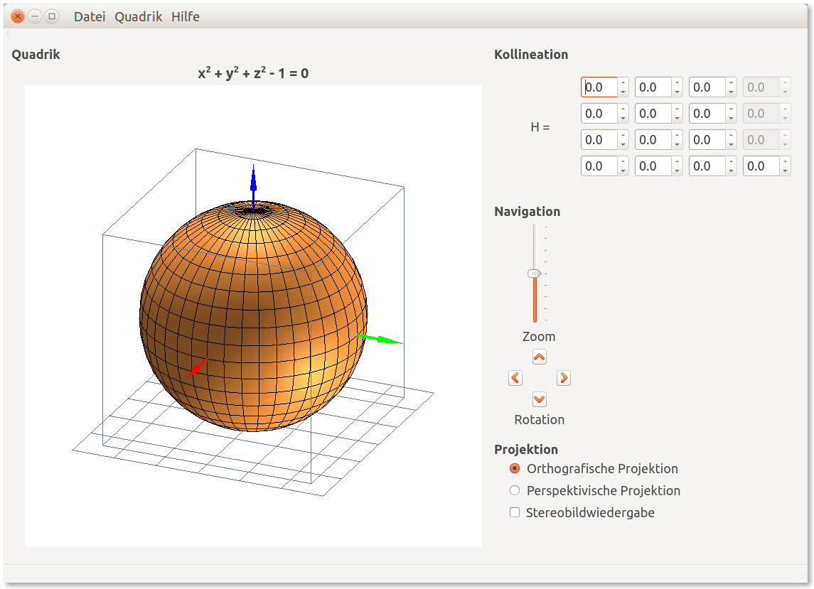

# Quadriken im Raum und ihre Schnittbilder an ebenen Flächen
Geometrische Algebra in der Computergrafik

Qt-Applikation zur Visualisierung von Quadriken im Raum.

##### Stichworte
- Projektiver Raum, homogene Koordinaten
- Kollineation, projektive Transformation
- Geometrische Transformation (Skalierung, Rotation)
- Orthogonale und perspektivische Projektion
- Stereoskopie, spektrales Multiplexing, Farbanaglyphen
- Objektorientierte Programmierung (OOP), Programmiersprache C/C++
- Qt-Designer, QGLWidget, OpenGL, GLUT, GLU, GLM, Vertex-Shader

##### Dokumente
- <a target="_blank" href="https://speakerdeck.com/brugr9/quadriken-im-raum-und-ihre-schnittbilder-an-ebenen-flachen">Präsentation</a> (auf Speaker Deck)
- <a target="_blank" href="https://www.hashdoc.com/documents/466376/quadriken-im-raum-und-ihre-schnittbilder-an-ebenen-flachen">Bericht</a> (auf Hashdoc)

Modul Objektorientierte Geometrie, Semesterarbeit FS 2015

Berner Fachhochschule für Technik und Informatik BFH-TI, Biel/Bienne.
